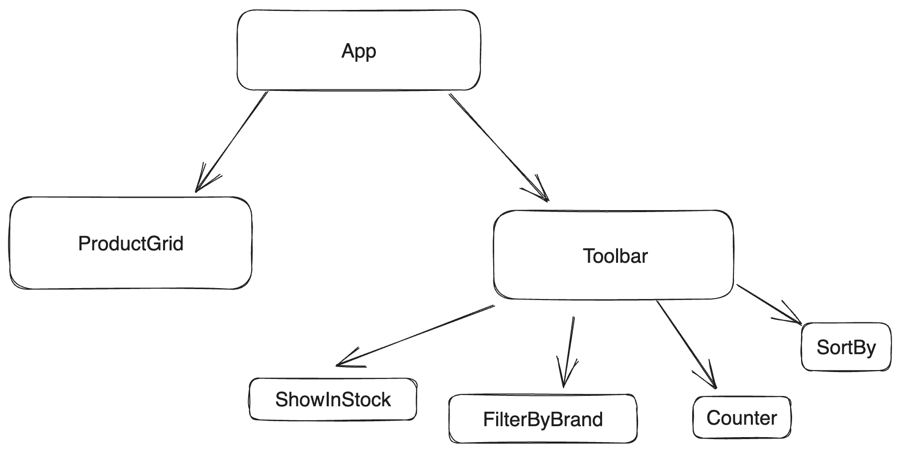
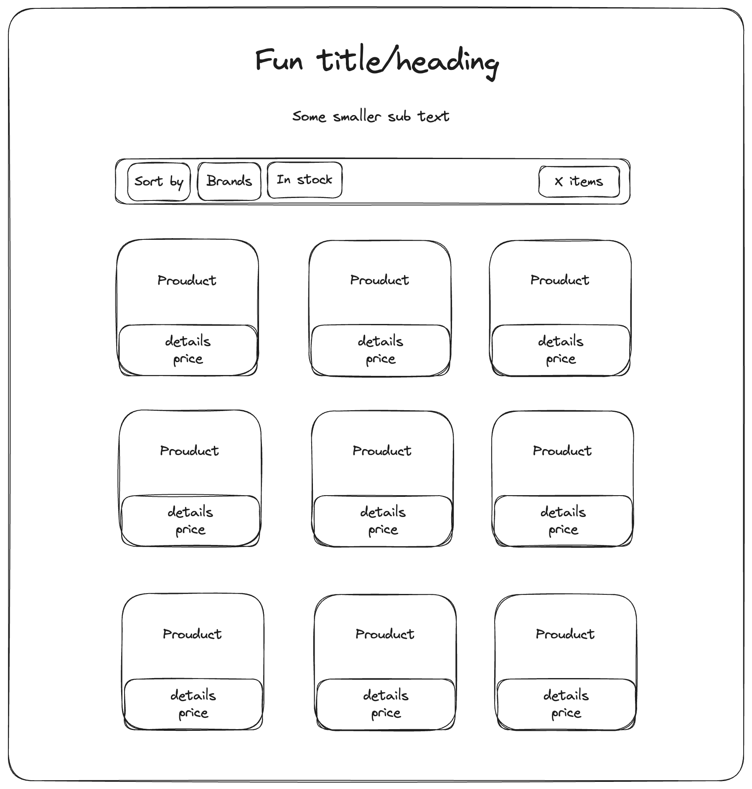

# Hullabalook Technical Assessment

You are provided with a set of products and are required to create a products listing page for a footwear retailer.

Write functionality and styling to:

- Lay out all products in a responsive product grid
- Create a filter toggle that shows only available products
- Create a checkbox brand filter that shows only toggled brand products
- Add a counter for the number of resulting products
- Create a dropdown to sort all products into ascending or descending price order
- Add an option to sort all products by relevance - with all available products shown first in ascending rank order, then all unavailable products in ascending rank order.

You will be assessed on both behaviour and design. Don't spend more than 2 hours on this.

## On reflection

Although I have done quite a bit of frontend work with javascript, Vue was completely new to me and so I spent the days prior to completing this assement experimenting with the framework. 

In the starter code, the products were provided in a file as JSON and passed to the componenets as props, however, I felt my design would work more effectiently if I could set the products as global state. Therfore, I moved them into a reactive store which allowed for reference from all areas of the component treen independently.

I tired to keep my grandchild compenents simplistic, redering only their templates and updating state as necessary. The ProductGrid compenent holds the bulk of my code. It is responsible for filtering, sorting and ensuring the items are rendered correctly.

On reflection, had I had more time and felt a little more confident with Vue, I would have tried to seperate out the filtering and sorting functions into their respective components. However, with limited time I kept them together to allow for an MVP with all requested funcationality. 

My initial component plan:

My initial design plan:

Here is a screenshot of the mvp after the two hours allocated:
